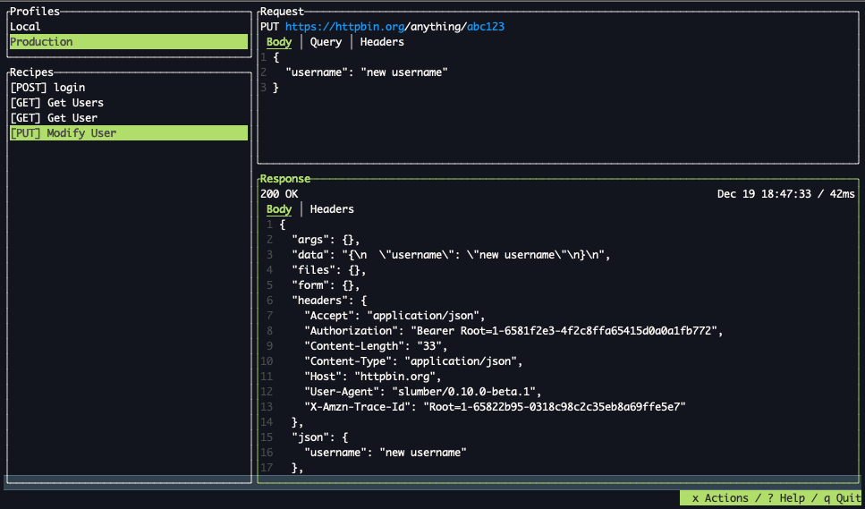

# Slumber

> Disclaimer: Slumber is still early in development. It is ready to use, but updates still will have occasional breaking changes. Until version 1.0 is released, be prepared to have to change your config file after upgrades. I'll do my best to keep the upgrades as smooth as possible.


- [Home Page](https://slumber.lucaspickering.me)
- [Installation](https://slumber.lucaspickering.me/artifacts/)
- [Docs](https://slumber.lucaspickering.me/book/)
- [Changelog](https://slumber.lucaspickering.me/changelog/)



Slumber is a TUI (terminal user interface) HTTP client. Define, execute, and share configurable HTTP requests. Slumber is built on some basic principles:

- It will remain free to use forever
- You own your data: all configuration and data is stored locally and can be checked into version control
- It will never be [enshittified](https://en.wikipedia.org/wiki/Enshittification)

## Examples

Slumber is based around **collections**. A collection is a group of request **recipes**, which are templates for the requests you want to run. A simple collection could be:

```yaml
# slumber.yml
requests:
  get:
    method: GET
    url: https://httpbin.org/get
```

Create this file, then run the TUI with `slumber`.

For a more extensive example, see [the docs](https://slumber.lucaspickering.me/book/getting_started.html).
